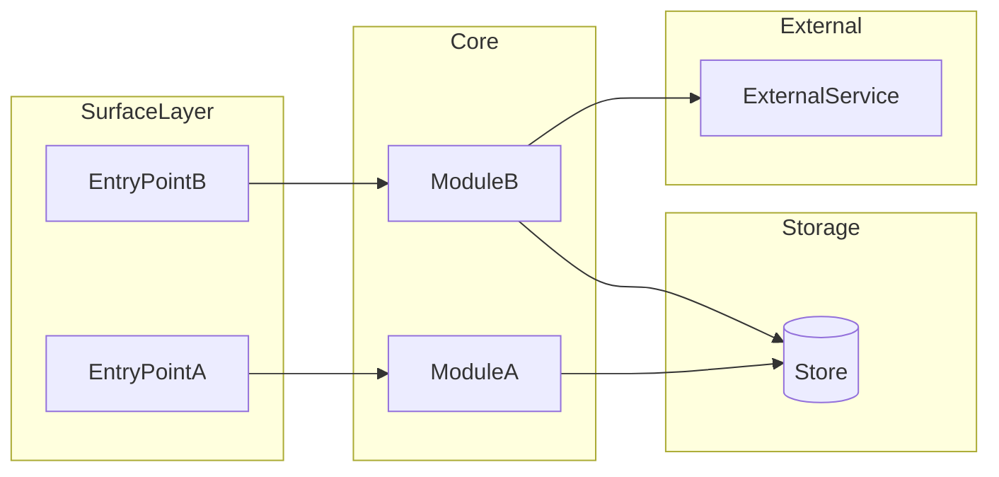

<!--
  GROK PLAN TEMPLATE — authoring guide (remove this block from output plans)

  Purpose: Implementation-ready build spec. Not a design review, PRD, timeline doc,
  or worker-agent brief. For execution behavior (stop rules, final report, engine
  settings), use fable/opus/gpt-5.5-coding-plan.template.md per phase or task.

  Plan modes — pick one, delete inapplicable sections:
    Greenfield  → Requirements, Decisions, Architecture, Structure, Phases
    Brownfield  → Context, Key Changes, Boundaries; prefer diff tree over full tree
    Feature slice → Context, Key Changes, Interface Spec, Test Plan; skip full Architecture
    Single-PR scope → collapse Implementation Phases to one checklist

  Required sections (default):
    Title, Summary, Requirements, Implementation Phases, Acceptance Criteria, Out of Scope

  Include when relevant:
    Context, Scope Invariants, Decisions, Key Changes, Suggested Path, Architecture,
    Project Structure, Data Contract, Core Logic, Interface Spec, Failure Modes,
    Test Plan, Assumptions, Risks, Dependencies, Execution Handoff, Open Questions

  Pick one label per slot (delete unused slots):
    Data contract  → SQLite Schema | API Schema | Event Format | State Model
    Core logic     → Scoring Logic | Auth Flow | Sync Pipeline | Domain Rules
    Interface spec → CLI Specification | API Specification | UI Flow | Event Contract

  Decisions rules:
    0 material forks  → delete Decisions section
    1–2 forks         → inline bullets under Summary (no table)
    3+ forks          → full Decisions table

  Verification roles (do not duplicate commands across sections):
    Test Plan           → automated matrix only (file → assertion)
    Acceptance Criteria → binary ship gates + operator smoke subsection
    Execution Handoff   → canonical validation commands for implementers

  Downstream handoff:
    Each phase may spawn coding-spec.template.md tasks or a worker coding plan.
    Do not embed worker instruction, stop rules, or final report format here.

  No-go (do not include in output plans):
    Timelines / estimates, team roles, oracle transcripts, PR stacks (unless /design),
    engine settings, worker instructions, stop rules, final report format,
    implementation code beyond type signatures

  Other rules:
    Non-Goals (v1) = hard exclusions; Out of Scope (v2+) = deferred future work
    File paths: markdown links when files exist or are planned
    Mermaid: camelCase node IDs, no spaces in IDs, no explicit colors
    Phases: 3–5 max (or one checklist for single-PR); stable task IDs; Depends on line
    Core logic signature: use project primary language; delete if fully covered in Data Contract
    Dependencies block: one example manifest; prefer pointing at real manifest path
-->

# {Project Name}

{One to two sentences: what this is, who it's for, and the primary output.}

**Plan version:** {v1}  
**Repo:** `{path}`  
**Status:** `Draft | Approved | Implementing | Done`  
**Derived specs:** {links to coding-spec tasks or issues — fill during execution, or "none yet"}

## Summary

{One short paragraph: greenfield or brownfield, version boundary, key stack choices, chosen approach, and high-level definition of done.}

{If 1–2 material forks only — inline here instead of a Decisions table:}
- **{Fork}:** chose {X} over {Y} because {rationale}

## Context

{Delete only for pure greenfield with zero repo conventions.}

- **Repo state:** {empty | partial scaffold | existing codebase}
- **Entry points:** {paths to main, routes, jobs, or commands}
- **Conventions to follow:** {toolchain, layout, naming, test runner, lint/format}
- **Touchpoints:** {files or modules likely to change}

### Current behavior

{Brief description of today's behavior, bug, limitation, or missing capability.}

### Desired behavior

{Target behavior. One concrete example only where it reduces ambiguity.}

### Patterns to reuse

- `{path or module}` — {helper, test pattern, error-handling, or data-access convention}
- `{path or module}` — {convention to mirror}

## Requirements

### Functional

- {Behavior 1 — observable outcome}
- {Behavior 2 — user or caller action}
- {Output format, export, or side effect}
- {Idempotency, caching, or repeat-run behavior if relevant}

### Non-Functional

- {Language, runtime, toolchain}
- {Storage, caching, offline or latency constraints}
- {Platform, deployment target, operator model}
- {Security, auth, or compliance constraints if any}

### Non-Goals (v1)

{Hard exclusions for this version — not deferred v2 features.}

- {No web UI}
- {No production writes}
- {No scope beyond defaults}

### {Domain Constants}

{Optional. Hardcoded entities, enums, watchlists, tiers, feature flags.}

- {Item 1}
- {Item 2}

## Scope Invariants

{Optional but recommended. Implementation guardrails — not worker-agent behavior rules.}

- Do not change public API, schema, or migrations unless listed in Key Changes
- Do not modify `{path / module / area}` 
- Do not add dependencies beyond Dependencies without updating Decisions or Summary
- Do not delete or weaken existing tests to satisfy this plan

## Decisions

{Delete if zero material forks. Use table only for 3+ forks; otherwise inline in Summary.}

| Question | Options considered | Chosen direction | Rationale |
|----------|-------------------|------------------|-----------|
| {Fork 1} | {Option A}, {Option B}, {Option C} | {Choice} | {Why for v1} |
| {Fork 2} | {Option A}, {Option B} | {Choice} | {Why} |
| {Fork 3} | {Option A}, {Option B} | {Choice} | {Why} |

## Key Changes

{Brownfield or feature slice only — delete for greenfield.}

- [`{path}`]({path}) — {what changes and why}
- [`{path}`]({path}) — {new module responsibility}
- {Migration, config, or env change if any}

## Suggested Path

{Optional. Non-binding exploration hints — not decisions.}

Likely files or patterns to inspect:

- `{path}` — {why}
- `{path}` — {why}

Likely implementation shape:

- {Short idea}
- {Edge case worth testing}

Use another path if it better satisfies Requirements and Scope Invariants.

## Architecture

{Include diagram when ≥3 components interact; otherwise short prose. Delete for trivial single-file changes.}



### Data flow

1. {Setup or init path}
2. {Write or ingest path}
3. {Compute or transform path}
4. {Read or export path}

### Boundaries

{Optional. Prevents logic leaking across layers.}

| Layer | Owns | Must not |
|-------|------|----------|
| {Surface} | {CLI parsing, HTTP routing} | {Business rules, SQL} |
| {Core} | {Pure logic, orchestration} | {Direct user I/O} |
| {Storage} | {Schema, queries, migrations} | {Domain rules} |

## Project Structure

{Greenfield: full tree. Brownfield: list creates/edits only. Use markdown links.}

```
{repo-root}/
├── README.md
├── PLAN.md
├── {manifest — pyproject.toml | package.json | Cargo.toml | go.mod}
├── {data/ | migrations/ | assets/}
├── {src/ | app/ | lib/}
│   └── {package}/
│       ├── {entry}
│       ├── {config}
│       ├── {persistence}
│       └── {core module}
└── {tests/}
    └── {test files}
```

## {Data Contract}

{Rename or delete. SQLite Schema | API Schema | Event Format | State Model.}

```sql
CREATE TABLE {table_name} (
    {column} {TYPE} {CONSTRAINTS}
);
```

### {Wire or fixture format}

{Optional.}

```json
{
  "{field}": "{type or example}"
}
```

## {Core Logic}

{Rename or delete if trivial CRUD. Scoring Logic | Auth Flow | Sync Pipeline | Domain Rules.}

For each {entity or unit of work}:

1. {Validate input — reject conditions}
2. {Normalize or rank}
3. {Compute primary metric or state transition}
4. {Apply rule, threshold, or branch}
5. {Persist, emit, or return}

**Invariants**

- {Rule that must always hold}
- {Edge case — missing data, ties, empty sets}

```{language}
# {module}.{file} — signature only; no implementation in plan
function {name}({params}: {Types}) -> {ReturnType}
```

## {Interface Spec}

{Rename. CLI Specification | API Specification | UI Flow | Event Contract.}

| Surface | Input | Output / Effect |
|---------|-------|-----------------|
| `{command or route}` | `{flags, body, params}` | {Behavior} |
| `{command or route}` | `{flags, body, params}` | {Behavior} |

### Configuration

{Optional.}

| Key | Default | Override |
|-----|---------|----------|
| `{config.key}` | `{value}` | `{CLI flag | env var}` |

### Example output

```
{COLUMN_A}  {COLUMN_B}  {COLUMN_C}
{value_a}   {value_b}   {value_c}
```

### Visual Direction

{Optional. Frontend/UI only.}

- **Palette:** {hex values or tonal description}
- **Typography:** {typeface direction}
- **Layout density:** {spacing / structure}
- **Motion:** {animation expectations}
- **References:** {examples or inspiration}

## Failure Modes

{Optional. Recommended when external deps or partial data exist.}

| Condition | User-visible behavior | Recovery |
|-----------|----------------------|----------|
| {Missing input data} | {Skip with warning | hard error} | {Refetch or fix config} |
| {External API down} | {Use cache | fail fast} | {Retry on next run} |
| {Invalid user input} | {Exit code N, message} | {Corrective action} |

## Implementation Phases

{3–5 phases for multi-step builds. Single-PR: replace with one checklist section.}

### Phase 1 — Scaffold

Depends on: {nothing | existing repo baseline}

- [ ] **scaffold-manifest** — {Initialize manifest, toolchain, lockfile}
- [ ] **scaffold-layout** — {Package layout and entry point}
- [ ] **scaffold-foundation** — {Config, persistence schema, shared models}
- [ ] **scaffold-smoke** — {Empty happy-path command runs}

**Produces:** `{files/modules}` · **Hand off as:** `{coding-spec | worker-brief}` · **Done when:** {acceptance subset}

### Phase 2 — {Ingest | Input | Integration}

Depends on: Phase 1

- [ ] **{id}** — {Fixtures, client, or adapter}
- [ ] **{id}** — {Load path into storage}
- [ ] **{id}** — {Wire surface to ingest module}
- [ ] **{id}** — {Audit metadata or run log}

**Produces:** `{files/modules}` · **Hand off as:** `{coding-spec | worker-brief}` · **Done when:** {acceptance subset}

### Phase 3 — {Core Logic | Features}

Depends on: Phase 2

- [ ] **{id}** — {Pure core logic module}
- [ ] **{id}** — {Persist computed artifacts}
- [ ] **{id}** — {Primary user-facing command or screen}
- [ ] **{id}** — {Secondary export or API surface}

**Produces:** `{files/modules}` · **Hand off as:** `{coding-spec | worker-brief}` · **Done when:** {acceptance subset}

### Phase 4 — Polish

Depends on: Phase 3

- [ ] **docs-readme** — {Setup and walkthrough}
- [ ] **tests-unit** — {Core logic and ingest tests}
- [ ] **tests-integration** — {End-to-end smoke without network}
- [ ] **quality-gates** — {Lint, typecheck, format}

**Produces:** `{files/modules}` · **Hand off as:** `{coding-spec | worker-brief}` · **Done when:** {acceptance subset}

## Test Plan

{Automated matrix only. Do not repeat acceptance or handoff commands here.}

| Test | File | Verifies |
|------|------|----------|
| {Happy path} | `{test path}` | {Known input → expected output} |
| {Edge case} | `{test path}` | {Boundary, empty, or missing data} |
| {Regression} | `{test path}` | {Invariant that must not return} |
| {Contract} | `{test path}` | {Schema, serialization, or API shape} |

**Conventions:** {in-memory DB, fixture dir, mock external I/O, no network in unit tests}

## Acceptance Criteria

{Binary ship gates.}

- [ ] `{setup command}` exits 0 on clean machine
- [ ] `{workflow command}` produces {expected artifact or row count}
- [ ] `{read surface}` shows ≥1 plausible result
- [ ] `{export command}` writes valid {JSON | CSV | file}
- [ ] `{test command}` passes
- [ ] `{lint/typecheck command}` passes
- [ ] README covers install, config, and operator smoke for {target platform}

### Operator smoke

{Numbered walkthrough — the human verification path.}

1. {Setup on clean environment}
2. {Seed or fetch}
3. {Primary action}
4. {Verify output visually or via inspection}
5. {Confirm tests and lint pass}

## Assumptions

{Explicit bets — not risks. Omit obvious items already in Requirements.}

- {Data source availability}
- {User or environment assumption}
- {v1 simplification downstream work may overturn}

## Risks and Mitigations

| Risk | Likelihood | Impact | Mitigation |
|------|------------|--------|------------|
| {External dep unreliable} | {L/M/H} | {L/M/H} | {Cache, fallback, fixture mode} |
| {Ambiguous domain rule} | {L/M/H} | {L/M/H} | {Document simplification; defer to v2} |
| {Thin source data} | {L/M/H} | {L/M/H} | {Skip rules, warnings, bundled fixtures} |

## Out of Scope (v2+)

{Deferred capabilities — not v1 Non-Goals.}

- {Feature deferred}
- {Integration deferred}
- {Surface deferred — UI, alerts, admin}

## Dependencies

{Delete if fully captured in manifest. Point to real file when it exists.}

Manifest: [`{pyproject.toml | package.json | ...}`]({path})

```toml
# Example only — swap for project's manifest format
[project]
dependencies = [
    "{package}>=0.0",
]

[project.optional-dependencies]
dev = ["{test-runner}>=0", "{linter}>=0", "{typechecker}>=0"]
```

## Execution Handoff

{How this plan becomes implementable work. Delete if plan author also executes in same session.}

### Do not touch

- `{path / module / area}` — {reason}
- `{path / module / area}` — {reason}

### Phase → spec mapping

| Phase | Spawn as | Tasks |
|-------|----------|-------|
| Phase 1 | `{coding-spec.template.md | opus-4.8-coding-plan.template.md}` | {task IDs or titles} |
| Phase 2 | `{template}` | {tasks} |
| Phase 3 | `{template}` | {tasks} |
| Phase 4 | `{template}` | {tasks} |

### Validation commands

{Canonical command block for implementers — single source of truth.}

```bash
{setup or sync command}
{targeted test command}
{typecheck or lint command}
{build or smoke command}
```

Implement the general solution. Tests verify correctness; they do not define it. Do not hard-code to visible fixtures or checks.

## Open Questions

{Hard blockers only. Resolve via Decisions when possible.}

- [ ] {Blocker — owner or resolution path}